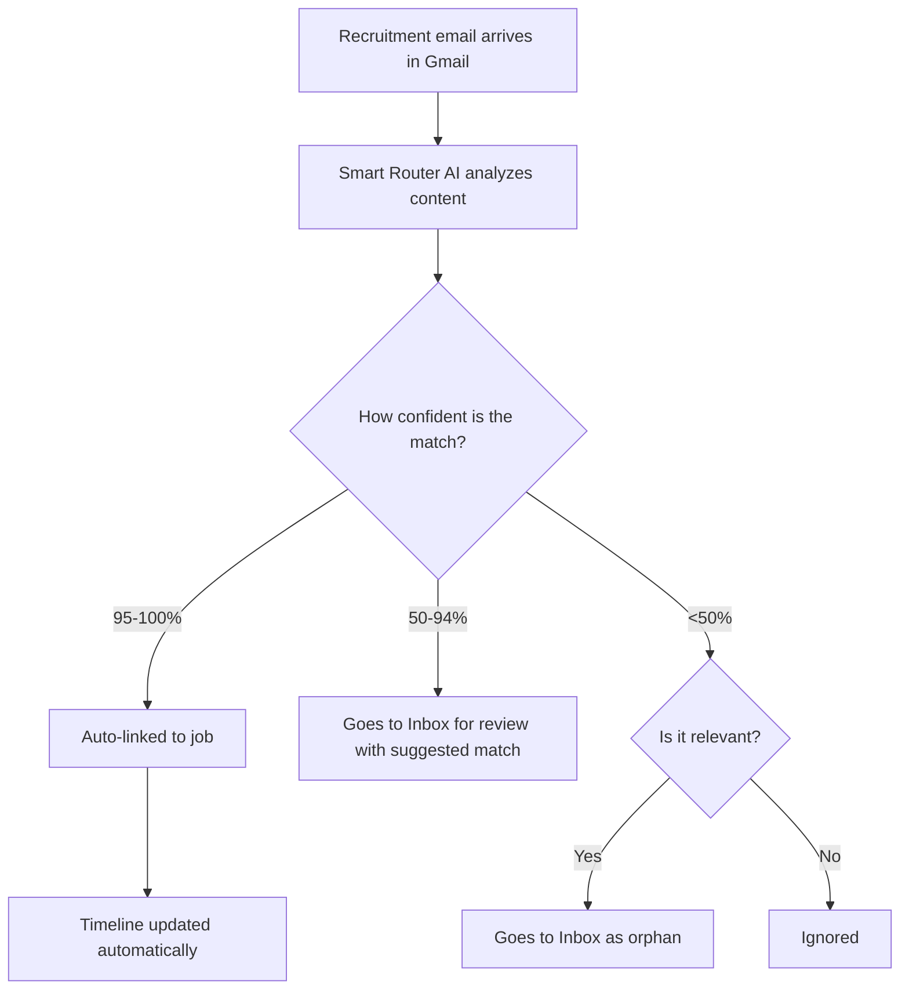

## What it is

The Tracking Inbox monitors Gmail for job-application responses, matches those
messages to tracked jobs, and helps you update application timelines.


It stores message metadata needed for review: sender, subject, received time,
snippet, message type, match confidence, suggested job, and suggested timeline
target. It does not store full email bodies.

## Why it exists

1. Scans Gmail for recruitment-related emails
2. Matches emails to tracked jobs using AI
3. Auto-links high-confidence replies
4. Queues uncertain or unmatched replies for manual review

Use it when you want interviews, offers, rejections, and follow-up messages to
land on the right job timeline without manually scanning your inbox.

## Smart router flow



## How to use it

### 1. Configure OAuth

You need a Gmail account with application emails and Google OAuth credentials.

Set:

```bash
GMAIL_OAUTH_CLIENT_ID=your-client-id.apps.googleusercontent.com
GMAIL_OAUTH_CLIENT_SECRET=your-client-secret
GMAIL_OAUTH_REDIRECT_URI=https://your-domain.com/oauth/gmail/callback
```

Detailed setup guide:

- [Gmail OAuth Setup](/docs/next/getting-started/gmail-oauth-setup)

### 2. Connect and sync

1. Open **Tracking Inbox**.
2. Open **Inbox settings**.
3. Click **Connect Gmail** and complete OAuth.
4. Click **Sync** to ingest recent recruitment replies.

Defaults:

- Provider: `gmail`
- Account key: `default`
- Max messages: `100`
- Search days: `90`

### 3. Review pending messages

1. Select a message from the review queue.
2. Check the sender, subject, snippet, message type, and confidence label.
3. Confirm the suggested job, or choose the correct applied/in-progress job.
4. Review the timeline update preview.
5. Click **Approve** to link/update the job timeline, or **Ignore** to mark the
   message as not useful.

Approval requires a selected applied or in-progress job. Messages without a
reliable match stay unapproved until you choose a job manually.

Bulk actions are secondary:

- **Approve suggested** approves messages with suggested job matches.
- **Ignore all** ignores all pending messages.

### 4. Review linked job emails

Open **Job → Emails** to review captured messages already linked to that job.

The tab is read-only. It shows stored metadata only: sender, subject, received
time, snippet, processing status, message type, match confidence, account label,
and a Gmail thread link when the stored message includes a Gmail thread ID.

It does not store full email bodies, re-fetch from Gmail, or expose review
actions. Use **Tracking Inbox** for approve/ignore decisions.

Confidence interpretation:

- `95-100%`: high-confidence match, usually auto-processed
- `50-94%`: needs review with a suggested job
- `<50%` or no score: needs a manual job match

## Privacy and security

- Scope requested: `gmail.readonly`
- Full scope: `https://www.googleapis.com/auth/gmail.readonly`
- Minimal metadata sent for matching
- Email data stays local in your instance

## API reference

| Method | Endpoint                                  | Description           |
| ------ | ----------------------------------------- | --------------------- |
| GET    | `/api/post-application/inbox`             | List pending messages |
| POST   | `/api/post-application/inbox/:id/approve` | Approve message       |
| POST   | `/api/post-application/inbox/:id/deny`    | Ignore message        |
| GET    | `/api/post-application/runs`              | List sync runs        |
| GET    | `/api/jobs/:id/emails?limit=100`          | List job-linked email metadata |
| GET    | `/api/post-application/providers/gmail/oauth/start` | Start OAuth flow |
| POST   | `/api/post-application/providers/gmail/oauth/exchange` | Exchange OAuth code |

## Common problems

- No refresh token: disconnect and reconnect Gmail.
- Emails not appearing: check runs, OAuth config, and recruitment subjects.
- Wrong matches: choose the correct applied/in-progress job before approving.
- Approve disabled: select a job first, or move the target job to applied or in
  progress.

## Related pages

- [Gmail OAuth Setup](/docs/next/getting-started/gmail-oauth-setup)
- [Post-Application Workflow](/docs/next/workflows/post-application-workflow)
- [In-Progress Board](/docs/next/features/in-progress-board)
