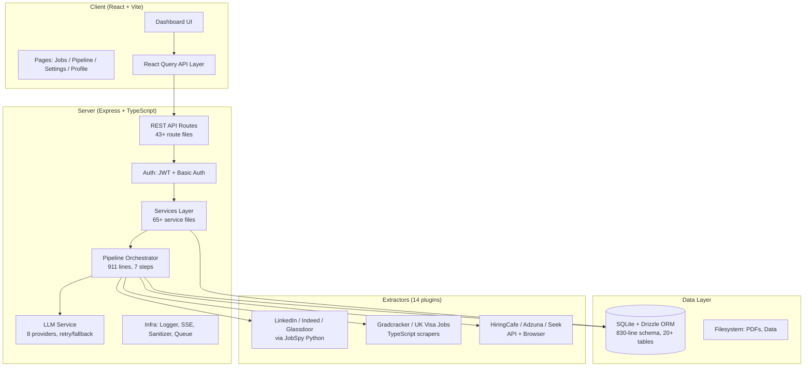
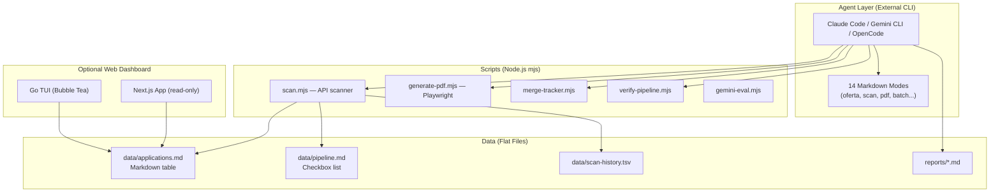
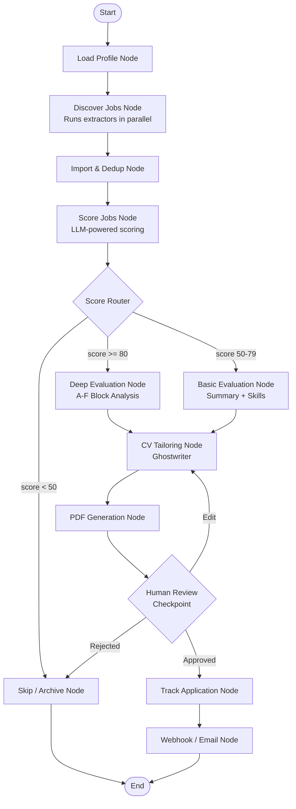
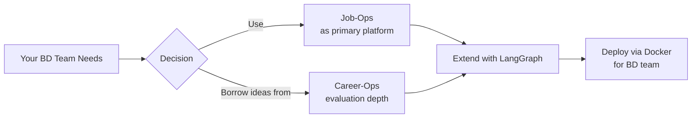

# Repository Evaluation: Job-Ops vs Career-Ops

> [!IMPORTANT]
> **Bottom line:** Job-Ops is the clear winner for your BD team. It's a production-grade web application with proper backend architecture, Docker deployment, multi-tenancy, and a pluggable LLM layer — exactly what a team needs. Career-Ops is a powerful personal CLI tool but fundamentally unsuitable for shared team deployment. LangGraph integration is feasible and would significantly enhance the pipeline.

---

## Architecture Comparison

### Job-Ops — Full-Stack Application



### Career-Ops — CLI Agent System



---

## Detailed Feature Comparison

| Dimension | Job-Ops | Career-Ops |
|-----------|---------|------------|
| **Architecture** | Monorepo: orchestrator + shared + extractors + docs-site | Flat repo: scripts + modes + config |
| **Backend** | Express server with typed API routes, middleware, auth | No backend server — relies on external AI CLI |
| **Database** | SQLite via Drizzle ORM (20+ tables, 830-line schema) | Flat files: `.md` tables, `.tsv`, `.yml` |
| **Auth & Multi-tenancy** | ✅ JWT sessions, users, tenants, memberships | ❌ Single-user only |
| **API Layer** | ✅ 43+ route handlers, `{ ok, data, error, meta }` contract | ❌ No HTTP API (read-only Next.js API routes) |
| **LLM Integration** | 8 providers (OpenAI, Gemini, OpenRouter, Ollama, Codex, LM Studio, Gemini CLI, OpenAI-compatible) | 2 providers (Claude Code CLI, Gemini API) |
| **Job Scoring** | Structured JSON schema scoring (0-100), configurable prompts | A-F block evaluation via markdown (rich but manual) |
| **CV Tailoring** | Ghostwriter: threaded chat per job, context-aware, streaming SSE | Markdown mode instructions for the AI to follow |
| **PDF Generation** | Typst + Tectonic + Reactive Resume export, tracer links | Playwright HTML-to-PDF with custom template |
| **Job Scraping** | 14 extractor plugins (TypeScript/Python), challenge handling | scan.mjs: Greenhouse/Ashby/Lever API only |
| **Post-Application** | Gmail integration, auto-detect interviews/rejections | Manual status tracking |
| **Pipeline** | Full orchestrator: discover → score → select → process → PDF | Agent-driven: paste URL → AI evaluates |
| **UI** | ✅ Rich React dashboard (Radix, Recharts, Framer Motion) | ❌ Go TUI + optional read-only Next.js page |
| **Test Suite** | 103 test files, ~25,000 lines (Vitest) | 1 test file (test-all.mjs, ~12K lines, script checks) |
| **CI/CD** | Biome linter, type checks, build validation, GHCR publishing | GitHub Actions, auto-labeler |
| **Deployment** | ✅ Docker Compose, GHCR, `docker compose up -d` | ❌ Local only (`npm install` + AI CLI required) |
| **License** | AGPLv3 + Commons Clause | MIT |

---

## Evaluation by Your Criteria

### 1. Which Has a Better Backend?

> [!TIP]
> **Winner: Job-Ops — by a massive margin**

Job-Ops has a **real, production-grade backend**:

- **Express server** with structured routing, middleware, error handling
- **Drizzle ORM** with a proper relational schema (users, tenants, jobs, interviews, pipeline runs, chat threads, post-application messages, settings, etc.)
- **830-line schema** with indexes, unique constraints, foreign keys, cascade deletes
- **1,178-line migration system** with versioned migrations
- **Structured LLM service** with provider abstraction, retry policies, mode selection, credential validation, and model listing
- **Repository pattern** separating data access from business logic
- **Infra layer**: structured logger, request context propagation, SSE helpers, sanitization, job queues
- **API contract**: standardized `{ ok, data/error, meta.requestId }` responses with correlation IDs

Career-Ops has **no backend at all**. It's a collection of Node.js scripts that read/write flat files. The "backend" is the AI CLI tool itself (Claude Code, Gemini CLI), which is an external dependency you don't control. The web dashboard is a read-only Next.js viewer.

### 2. Which Is More Extensible and Robust?

> [!TIP]
> **Winner: Job-Ops — architecturally designed for extension**

**Job-Ops extensibility:**
- **Plugin architecture**: Add a new job board by creating an extractor directory under `extractors/` with a manifest. The orchestrator auto-discovers it.
- **Settings system**: All configuration is DB-backed, editable via UI. Scoring instructions, prompt templates, LLM provider — all changeable at runtime.
- **Service layer**: Clean separation (scorer, ghostwriter, summary, profile, PDF, resume-renderer) makes it easy to add new capabilities.
- **Multi-tenant from day 1**: Every table is tenant-scoped. Adding workspaces for different BD team members is built-in.
- **Shared types package**: TypeScript types shared between server and client ensure consistency.

**Career-Ops extensibility:**
- Adding functionality means writing a new `.mjs` script and a new markdown mode
- No type safety across the system
- Profile customization is clever (user layer vs system layer), but it's designed for one person
- The "modes" system is creative but relies entirely on the AI CLI interpreting markdown correctly

**Robustness:**
- Job-Ops: 103 test files covering scoring, tailoring, pipeline, API contracts, tenant isolation, settings, etc.
- Career-Ops: A single `test-all.mjs` script checking file integrity and liveness — no unit tests for core logic

### 3. Which Can Be Deployed for a BD Team?

> [!IMPORTANT]
> **Winner: Job-Ops — the only real option**

**Job-Ops deployment:**
```bash
git clone https://github.com/DaKheera47/job-ops.git
cd job-ops
docker compose up -d
# Open http://localhost:3005 — done
```

- Production-ready `Dockerfile` (247 lines, multi-stage, multi-arch)
- `docker-compose.yml` with volumes, health checks, env file support
- GHCR container images published via CI
- Onboarding wizard in the UI
- Multi-user support with authentication
- Each team member gets their own workspace/tenant

**Career-Ops deployment for a team:**

There is **no team deployment path**. Career-Ops requires:
1. Each user installs an AI CLI tool (Claude Code = $20/month Anthropic subscription)
2. Each user clones the repo locally
3. Each user configures their own `cv.md`, `config/profile.yml`, `portals.yml`
4. No shared dashboard, no shared database, no centralized management
5. The web dashboard is read-only and reads local files

You would need to fundamentally rebuild Career-Ops to make it team-deployable.

---

## What Career-Ops Does Better

Career-Ops deserves credit for several ideas worth incorporating:

| Feature | Why It's Valuable |
|---------|-------------------|
| **A-F Block Evaluation** | Much richer than a 0-100 score — includes gap analysis, level strategy, comp research, interview prep |
| **STAR+R Story Bank** | Accumulates reusable interview stories across evaluations |
| **Posting Legitimacy (Block G)** | Ghost-job detection that saves wasted effort |
| **Archetype Detection** | Classifies roles into archetypes for better matching |
| **Portal Scanner** | Zero-LLM-token scanning — pure API calls to Greenhouse/Ashby/Lever |
| **Multi-language Modes** | DE/FR/JA localized evaluation modes |

These features can be incorporated into Job-Ops as new services and pipeline steps.

---

## LangGraph Integration Assessment

### What Is LangGraph?

LangGraph is a framework for building stateful, multi-agent workflows as directed graphs. Each node is an agent/tool, edges define control flow, and state persists across steps — with built-in support for human-in-the-loop, checkpointing, and conditional branching.

### Why LangGraph Fits This Use Case

Job-Ops already has a pipeline orchestrator ([orchestrator.ts](file:///home/dev/Desktop/job-ops/orchestrator/src/server/pipeline/orchestrator.ts)) that runs steps sequentially:

```
loadProfile → discoverJobs → importJobs → scoreJobs → selectJobs → processJobs → generatePDF
```

This is a **graph** with linear flow, challenge pauses, and error handling — exactly what LangGraph is designed for. Current pain points LangGraph would solve:

| Current Pain Point | LangGraph Solution |
|---|---|
| Pipeline steps are hardcoded in a 900-line async function | Each step becomes a **node** — composable, testable, replaceable |
| Challenge pause/resume uses raw Promises + in-memory state | LangGraph **checkpoints** persist state to SQLite, survive restarts |
| No branching logic (e.g., deep research for high-scoring jobs) | **Conditional edges** route jobs through different paths based on score |
| Ghostwriter is a separate service with no pipeline integration | Becomes a **node** that can be triggered conditionally |
| No sub-agent orchestration | LangGraph supports **sub-graphs** for parallel job evaluation |

### Proposed LangGraph Architecture



### Implementation Plan

> [!NOTE]
> LangGraph.js (`@langchain/langgraph`) is the TypeScript implementation. It integrates cleanly with Job-Ops's existing Node.js/TypeScript stack.

**Phase 1 — Foundation (1-2 weeks)**
```bash
npm install @langchain/langgraph @langchain/core
```
- Define the `PipelineState` as a LangGraph `Annotation`
- Wrap existing pipeline steps as LangGraph nodes
- Use SQLite checkpointing (Job-Ops already has SQLite)
- Replace the 900-line `runPipeline()` with a `StateGraph`

**Phase 2 — Smart Routing (1 week)**
- Add conditional edges based on scoring thresholds
- High-scoring jobs → deep evaluation (A-F blocks from Career-Ops)
- Add parallel evaluation sub-graph for batch processing

**Phase 3 — Human-in-the-Loop (1 week)**
- Add checkpoint-based HITL for CV review before PDF generation
- SSE notifications when pipeline is waiting for human input
- Resume pipeline from checkpoint after user approval

**Phase 4 — Advanced Agents (2 weeks)**
- Add a "Company Research" sub-agent (similar to Career-Ops `deep` mode)
- Add an "Interview Prep" agent that generates STAR stories
- Add a "Posting Legitimacy" agent that checks for ghost jobs

### Integration Code Sketch

```typescript
// orchestrator/src/server/pipeline/langgraph/graph.ts
import { Annotation, StateGraph } from "@langchain/langgraph";
import { SqliteSaver } from "@langchain/langgraph/checkpoint/sqlite";

// 1. Define state schema
const PipelineState = Annotation.Root({
  profile: Annotation<ProfileData>,
  discoveredJobs: Annotation<Job[]>({ reducer: (a, b) => [...a, ...b] }),
  scoredJobs: Annotation<ScoredJob[]>,
  selectedJobs: Annotation<Job[]>,
  processedJobs: Annotation<ProcessedJob[]>,
  pdfPaths: Annotation<Map<string, string>>,
  errors: Annotation<PipelineError[]>({ reducer: (a, b) => [...a, ...b] }),
});

// 2. Build graph
const graph = new StateGraph(PipelineState)
  .addNode("loadProfile", loadProfileNode)
  .addNode("discoverJobs", discoverJobsNode)
  .addNode("scoreJobs", scoreJobsNode)
  .addNode("deepEvaluate", deepEvaluateNode)
  .addNode("tailorCV", tailorCVNode)
  .addNode("generatePDF", generatePDFNode)
  .addNode("humanReview", humanReviewNode)
  .addEdge("__start__", "loadProfile")
  .addEdge("loadProfile", "discoverJobs")
  .addEdge("discoverJobs", "scoreJobs")
  .addConditionalEdges("scoreJobs", routeByScore, {
    deep: "deepEvaluate",
    basic: "tailorCV",
    skip: "__end__",
  })
  .addEdge("deepEvaluate", "tailorCV")
  .addEdge("tailorCV", "generatePDF")
  .addEdge("generatePDF", "humanReview")
  .addEdge("humanReview", "__end__");

// 3. Checkpoint to SQLite (reuse existing DB)
const checkpointer = SqliteSaver.fromConnString("data/job-ops.db");
const app = graph.compile({ checkpointer });
```

---

## Final Recommendation



### Action Plan

| Step | Action | Priority |
|------|--------|----------|
| 1 | **Deploy Job-Ops** on your server via `docker compose up -d` | 🔴 Now |
| 2 | **Configure LLM provider** (Gemini API free tier or OpenRouter) | 🔴 Now |
| 3 | **Set up user accounts** for each BD team member | 🔴 Now |
| 4 | **Customize scoring prompts** for your BD-specific criteria | 🟡 Week 1 |
| 5 | **Add LangGraph** to replace pipeline orchestrator | 🟡 Week 2-3 |
| 6 | **Port Career-Ops evaluation depth** (A-F blocks, archetype detection) as LangGraph nodes | 🟢 Week 4-5 |
| 7 | **Add interview prep** and story bank features | 🟢 Week 6+ |

> [!CAUTION]
> **Do not try to "merge" the codebases.** They are fundamentally different architectures. Instead, use Job-Ops as the platform and selectively port Career-Ops *ideas* (not code) as new services and LangGraph nodes.
